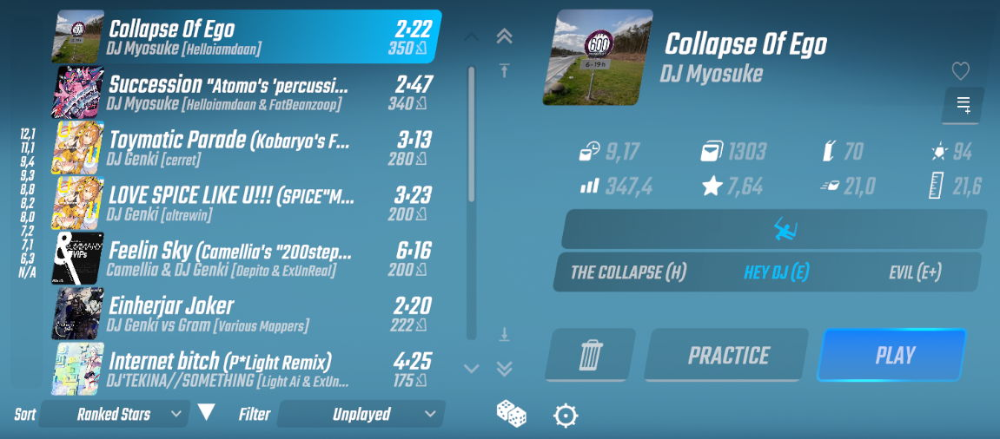

# Better Song List

The smaller brother of [Better Song Search](https://github.com/kinsi55/BeatSaber_BetterSongSearch#better-song-search). Adds Various improvements to the Basegame Map list like Filters, a persisted state and much more. Aims to be highly optimized.

---

The Game version(s) specific releases are compatible with are mentioned in the Release title (Its obviously possible latest is not supported assuming its been released recently). If you need the plugin for an older version - Grab an older release that fits 🤯

## Install

#### You can always find the latest download in [The Releases](https://github.com/kinsi55/BeatSaber_BetterSongList/releases), simply drag the Plugin DLL into the Plugins folder

### Dependencies

- BeatSaberMarkupLanguage (Available in ModAssistant)
- SongCore (Available in ModAssistant)
- Optional: If you want to be able to use extended features like sorting by BeatSaver date / Showing Star ratings and the like, you need [SongDetailsCache](https://github.com/kinsi55/BeatSaber_SongDetails/releases/latest) (Available in ModAssistant)

## Features

- Adds various sorting and filtering methods as well as a "Random Song" button
- Rembers 😁 your last selected Category / Playlist / Song and returns there
- Context-Aware legend-scrollbar whose steps are determined by your sorting method
- Fixes the shifting around of Practice / Play buttons when using Scoresaber
- Displays the map Default Jump Distance (Can be changed to show the maps Offset if you prefer that)
- Extended Scroll buttons
- Adds various extra details about the Song Like Ranked Information and NJS
- Plugin system - You can add your own Sorts & Filters to Better Song List!
- Probably other minor things I Forgor 💀

